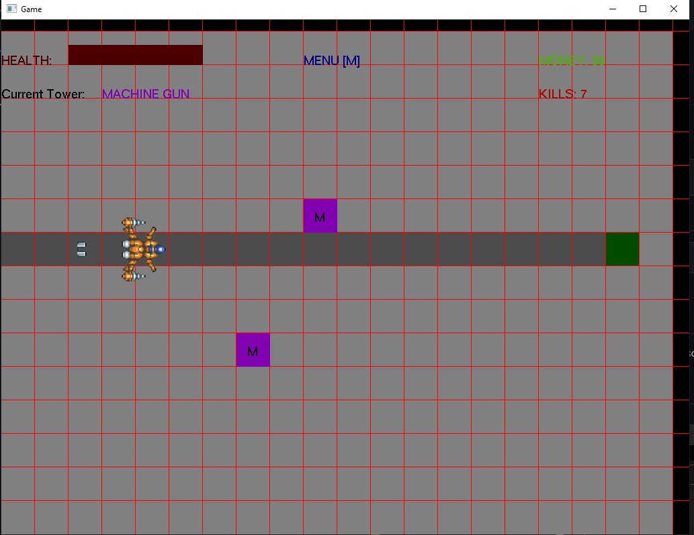
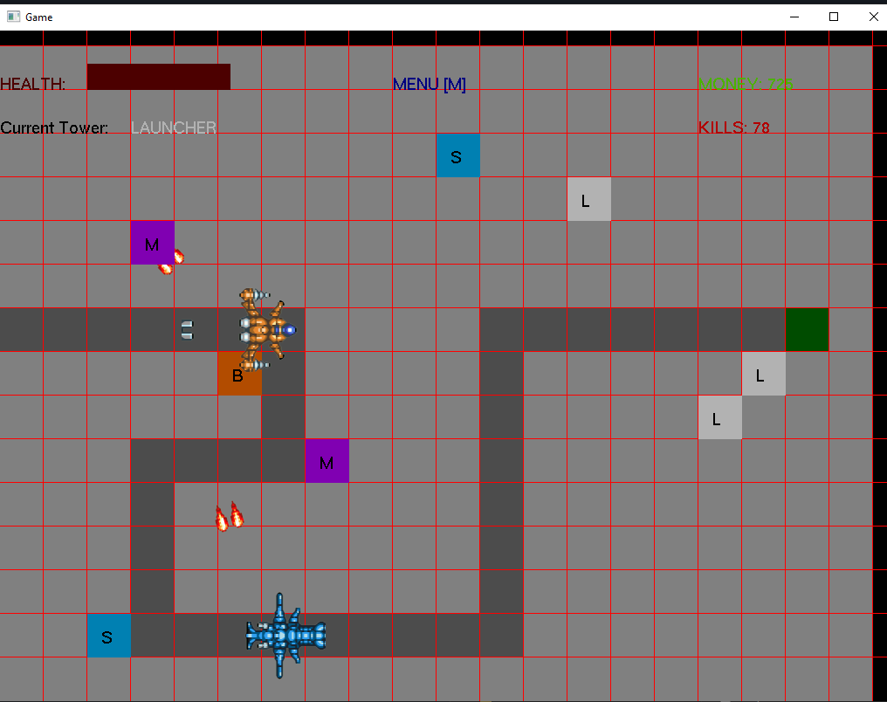

# UntitledTowerDefense
A tower defense game made with C++ for the Ubisoft NEXT 2021 programming competition. Uses a custom API provided by Ubisoft for all the rendering.

## Gameplay 

The main mechanic in this game is that you can change the path that the enemies travel while the game is running. The enemies uses A* to figure out where to go and will adjust as the path changes.

The game starts with a path straight to the base but over time you can alternate that path by buying roads with money earned from killing enemies.

There are 4 different towers you can use with all different advantages/disadvantages and at different prices.

### Machine Gun

The average tower. Average damage distance, damage, and fire rate. The cheapest option but won't do any good as the enemies get harder.

### Blaster

The shotgun like tower. Very small range and slow fire rate but packs a lot of punch.

### Sniper

High damage, large range. Can take out an enemy from the other side of the screen but it will cost you.

### Launcher

The most expensive tower and for good reason. High damage rockets that will follow an enemy as they move down the path.

## How To Run

This repo only contains the source code but there is a release build of the game that can be downloaded and played in the release tab.
